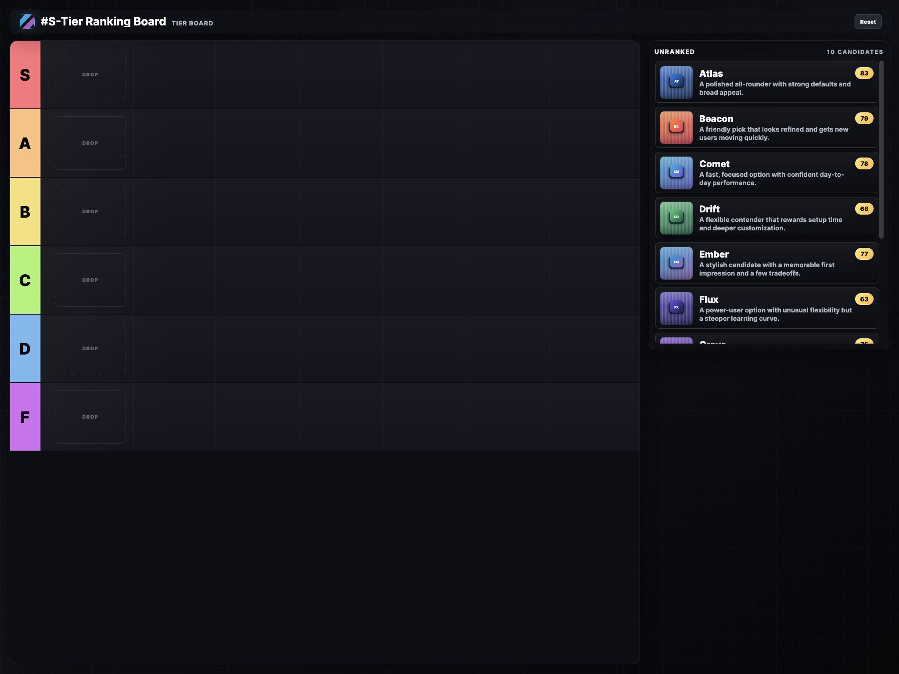

# Tier Ranking App

Static browser app for ranking candidates into tiers.



## Run

```sh
python3 -m http.server 4173 --bind 127.0.0.1
```

Open `http://127.0.0.1:4173/`.

## Config

Edit `config.yml` to change the title, tiers, rubric, and candidates.

The app also has a `Config` button. It opens the current YAML in the browser so you can edit it, validate with `Apply`, and export it with `Download config.yml`. Browsers with file save support also show `Save as config.yml`. `Reset` reloads `config.yml` from disk/network.

```yaml
title: "#My Ranking Board"
tiers: [S, A, B, C, D, F]

rubric:
  ease:
    label: Ease of use
    weight: 1
    max: 10
  performance:
    label: Performance
    weight: 1
    max: 10

candidates:
  - name: Atlas
    image: ./assets/candidates/atlas.svg
    description: Polished all-rounder.
    tier: Unranked
    scores:
      ease: 8
      performance: 9
```

## Docker

```yaml
services:
  tier-ranking-app:
    image: ghcr.io/ironicbadger/tier-ranking-app:latest
    ports:
      - "4173:80"
    volumes:
      - ./config.yml:/usr/share/nginx/html/config.yml:ro
```

```sh
docker compose up -d
```

Image: `ghcr.io/ironicbadger/tier-ranking-app:latest`
